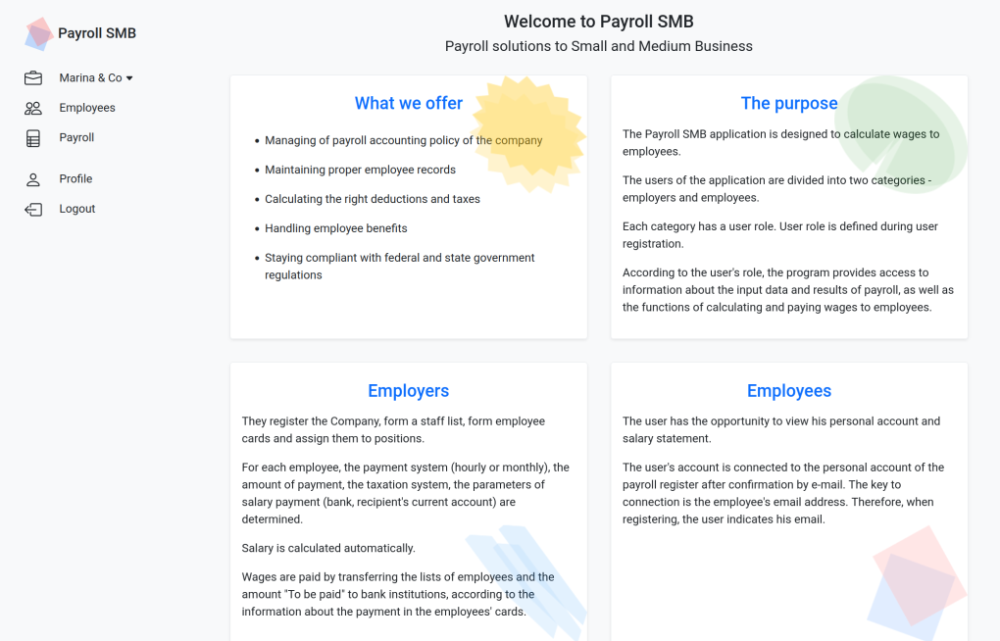

# Payroll for Small and Medium Businesses

## Distinctiveness

The Payroll SMB application provides a **solution for employers and employees to calculate salary** and taxes based on laws for chosen country.

## Complexity

This project uses:
- 14 Django models
- Django Rest Framework for Backend
- React.js for frontend, 15 interface pages
- Bootstrap 5 as a CSS library
- User authentication and JWT
- Axios HTTP Client to make requests to a REST API on the backend server
- React Router to organize frontend pages, routes and make context

## Preview



## Video screencast on Youtube

[Link to Video screencast on Youtube](https://youtu.be/Hg5s5_6zE3o)

## Files and directory structure

|File / directory        |Description|
|-------------------------|-----------|
|backend                  |Django project configuration directory|
|frontend                 |Frontend application directory|
|frontend\public          |images, favicon, logo|
|frontend\src             |source files directory for frontend|
|frontend\src\api\index.js|Axios config, and hooks, JWT config|
|frontend\src\components  |React components: Sidenav, Button, PageHeader, Toast, etc.|
|frontend\src\context     |React context providers for Auth, Company, User entities|
|frontend\src\pages       |Frontend pages: Register, Login, Company, Employees, Payroll, etc.|
|frontend\src\router      |Frontend routes config, Wrappers for the different access scenarios|
|frontend\src\services    |Service interface between interface data components and Axios REST API|
|frontend\src\services\authService.js|Auth service|
|frontend\src\services\dateService.js|Functions to handle formatting and convert date and dateTime data types|
|frontend\src\App.js     |Frontend application main file|
|frontend\src\index.js   |React.js application entrypoint file|
|frontend\src\styles.css |Main style sheet file|
|frontend\\.gitignore |Lis of files and directories to skip in git synchronization|****
|frontend\package.json |Frontend application config file for npm |
|payroll          |Backend Django Rest Framework application directory|
|payroll\lib\date_utils.py|Functions to manipulate with date and dataTime data types - format, convert, etc|
|payroll\lib\run_payroll.py|Functions and procedures to calculate payroll for employees and companies|
|payroll\migrations|Files for creating a database structure and filling tables|
|payroll\models.py|Descripes DB structure|
|payroll\serializers.py|Describes physical and virtual entity attributes for endpoints|
|payroll\tests.py|Some tests|
|payroll\urls.py|Routes config|
|payroll\views.py|Endpoints definitions|
|install.sh       |bash script to install development environment (python, pip, nodejs, mkdir, git clone project)|
|start.sh         |bash script to start application - starts the backend and the frontend simultaneously|
|requirements.txt |list of the backend components

## Getting Started

To launch the application, navigate to the project directory and run the script:

``` bash
./start.sh
```

This script will launch the backend and the frontend applications simultaneously.

## Additional information

The host machine must have development environment for Python and JavaScript.

If it is not, try to install it by execute the script:

``` bash
./install.sh
```

Another method to launch the application:

launch the backend:

``` bash
python -m venv .venv
source ./.venv/bin/activate
pip install -r requirements.txt
python manage.py migrate
python manage.py runserver
```

and then launch the frontend:

``` bash
cd ./frontend
npm install
npm start
```

## Scenario

### 1. Register as a new employer user

- In the left sidebar choose *Register*.
- In the Register form enter *email*, *password*, select the *user role: Employer* and click the *Register* button.

### 2. Create a Company

- In the left sidebar choose *Company - Create a new company*.
- In the new company form, enter a company *Name* and click the *Create* button.

### 3. Add the employees

- In the left sidebar choose *Employees* and in the right side click *Add a new employee* button.
- In the new employee form, enter *First name*, *Last name*, *Email*, *Wage*.

*For example:*
```
First name: Mary, Last Name: Lee, Email: mary_lee@mail.com, Wage: 5000.
```
*Later, at the specified e-mail address, the employee will see the employee card and the salary statement.*

- Click *Save* button.
- The same method use to add the other employees.

### 4. Run payroll

- In the left sidebar choose *Payroll* and you will see employees calculated payment.

### 5. Logout the employer user

- In the left sidebar choose *Logout*, and confirm *Logout*.

### 6. Register as employee user

- In the left sidebar choose *Register*.
- In the Register form enter *Email*, *Password*, select the *User role: Employee* and click the *Register* button.

*For example:*
```
Email: mary_lee@mail.com, Password: desired, User role: Employee
```
*At the specified e-mail address, the employee will see the employee card and salary statement if the employer had specified the e-mail when the employee card was created.*

### 7. View the employee card

- In the left sidebar choose *Personal card*, and you will see the employee's personal data.

### 7. View the employee payroll

- In the left sidebar choose *Payroll*, and you will see the employee's payroll.
- Each record in the table provide calculated amount of wage, bonus, taxes, and net pay by pay period.
